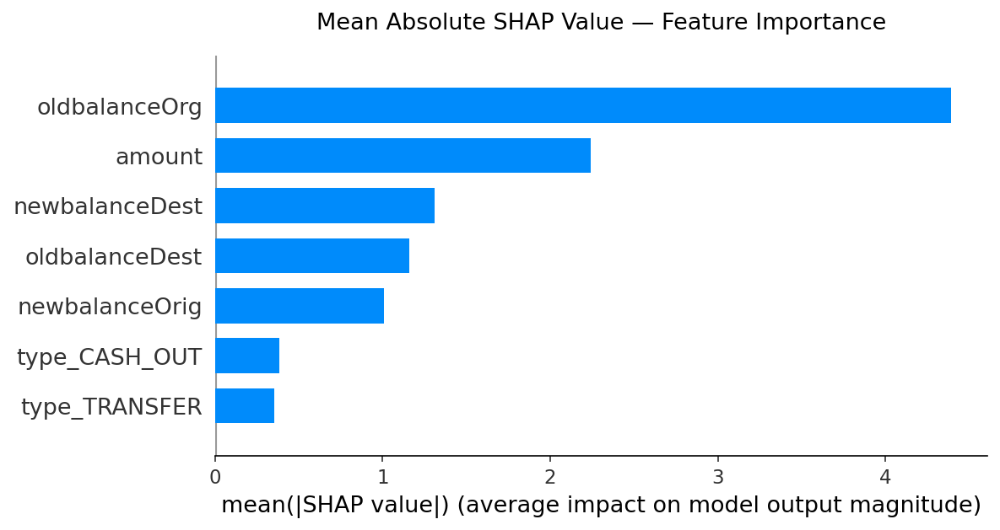

# Fraud Detection — XGBoost Scoring API

A real-time fraud scoring service built on XGBoost, served via FastAPI. The model outputs a fraud probability score (0 to 1) for each transaction, making it suitable for rule-based downstream decisioning — flag, block, or review — based on score thresholds.

Fraud types covered: CASH_OUT and TRANSFER transactions.

Trained on the [PaySim synthetic financial dataset](https://www.kaggle.com/datasets/ealaxi/paysim1) — a publicly available simulation of mobile money transactions, widely used as a benchmark for fraud detection modelling. The dataset is not included in this repo; download it from Kaggle if you want to retrain.

---

## What This Is

The model does not return a binary yes/no. It returns a **fraud score** — a probability between 0 and 1. The higher the score, the more likely the transaction is fraudulent. This is intentional: it lets you set your own operational threshold based on your risk appetite (e.g., block anything above 0.9, flag anything above 0.5 for review).

This is standard practice in financial fraud systems. A hard classifier loses information; a score preserves it.

---

## Project Structure

```
├── app/                    
│   ├── main.py             # API endpoints
│   ├── model.py            # Model loading and prediction
│   └── input_output.py     # Request and response schemas
├── notebooks/              
│   ├── 01_data_prep.ipynb
│   ├── 02_xgboost_training.ipynb      # Single full model training
│   ├── 03_xgboost_segments.ipynb      # Segment models (CASH_OUT, TRANSFER)
│   ├── 04_model_comparison.ipynb
│   └── 05_model_test.ipynb
├── training/               
│   └── xgboost_trainer.py  # Optuna hyperparameter tuning wrapper
├── model/                  
│   ├── XGBOOST_FULL.joblib
│   └── XGBOOST_FULL.json
├── requirements.txt
└── README.md
```

---

## Model Training

Two approaches were trained and compared:

**Approach 1 — Single model:** One XGBoost trained on all CASH_OUT and TRANSFER transactions together, with transaction type as binary flags.

**Approach 2 — Segment models:** Two separate XGBoost models, one for CASH_OUT and one for TRANSFER, each trained only on their respective transaction type.

Both approaches used Optuna for hyperparameter tuning with 5-fold stratified cross-validation, optimising for **AUC-PR** (area under precision-recall curve). KS statistic was tracked as a secondary metric.

**Why AUC-PR over AUC-ROC:** The dataset is heavily imbalanced (fraud is rare). AUC-ROC is misleading in this case because it includes true negatives — a model that never predicts fraud can still score well. AUC-PR focuses only on the fraud class and is a stricter, more meaningful metric here.

---

## Model Comparison

### Training Metrics

| Model | CV AUC-PR | CV KS Stat | Test AUC-PR | Test KS Stat |
|---|---|---|---|---|
| Full model (CASH_OUT + TRANSFER) | 0.9218 | 0.9808 | 0.9248 | 0.9839 |
| Segment — CASH_OUT | 0.6677 | 0.9392 | 0.6527 | 0.9326 |
| Segment — TRANSFER | 0.9952 | 0.9965 | 0.9955 | 0.9965 |

### Score Distribution on Holdout (30% of data, unseen during training)

These tables show how well the model concentrates fraud into the high-score buckets. A good model pushes most fraud cases into the 0.9-1.0 band.

**Full model — all transactions:**

| Score Band | Fraud Cases | Fraud Volume ($) | % of Total Fraud Cases | % of Total Fraud Volume |
|---|---|---|---|---|
| 0.0 - 0.1 | 43 | 5,201,727 | 1.72% | 0.14% |
| 0.1 - 0.2 | 43 | 3,266,912 | 1.72% | 0.09% |
| 0.2 - 0.3 | 21 | 1,622,831 | 0.84% | 0.04% |
| 0.3 - 0.4 | 29 | 3,768,571 | 1.16% | 0.10% |
| 0.4 - 0.5 | 27 | 5,638,568 | 1.08% | 0.16% |
| 0.5 - 0.6 | 39 | 7,411,837 | 1.56% | 0.20% |
| 0.6 - 0.7 | 37 | 5,279,440 | 1.48% | 0.15% |
| 0.7 - 0.8 | 57 | 9,626,188 | 2.28% | 0.26% |
| 0.8 - 0.9 | 99 | 16,324,360 | 3.97% | 0.45% |
| 0.9 - 1.0 | 2101 | 3,577,976,000 | **84.17%** | **98.40%** |

**Segment model — CASH_OUT only:**

| Score Band | Fraud Cases | Fraud Volume ($) | % of Total Fraud Cases | % of Total Fraud Volume |
|---|---|---|---|---|
| 0.0 - 0.1 | 61 | 4,023,539 | 4.88% | 0.22% |
| 0.1 - 0.2 | 68 | 5,897,395 | 5.44% | 0.32% |
| 0.2 - 0.3 | 70 | 8,121,363 | 5.60% | 0.44% |
| 0.3 - 0.4 | 64 | 9,634,420 | 5.12% | 0.52% |
| 0.4 - 0.5 | 66 | 10,167,070 | 5.28% | 0.55% |
| 0.5 - 0.6 | 80 | 15,941,780 | 6.40% | 0.86% |
| 0.6 - 0.7 | 70 | 15,452,930 | 5.60% | 0.83% |
| 0.7 - 0.8 | 91 | 20,960,800 | 7.28% | 1.13% |
| 0.8 - 0.9 | 111 | 34,714,410 | 8.88% | 1.87% |
| 0.9 - 1.0 | 569 | 1,730,464,000 | **45.52%** | **93.27%** |

**Segment model — TRANSFER only:**

| Score Band | Fraud Cases | Fraud Volume ($) | % of Total Fraud Cases | % of Total Fraud Volume |
|---|---|---|---|---|
| 0.0 - 0.1 | 2 | 2,928,374 | 0.16% | 0.17% |
| 0.1 - 0.2 | 0 | 0 | 0.00% | 0.00% |
| 0.2 - 0.3 | 0 | 0 | 0.00% | 0.00% |
| 0.3 - 0.4 | 5 | 398,288 | 0.41% | 0.02% |
| 0.4 - 0.5 | 1 | 10,358 | 0.08% | 0.00% |
| 0.5 - 0.6 | 4 | 337,572 | 0.33% | 0.02% |
| 0.6 - 0.7 | 5 | 24,911 | 0.41% | 0.00% |
| 0.7 - 0.8 | 1 | 10,277 | 0.08% | 0.00% |
| 0.8 - 0.9 | 1 | 20,986 | 0.08% | 0.00% |
| 0.9 - 1.0 | 1200 | 1,708,575,000 | **98.44%** | **99.78%** |

---

## Conclusion: Single Model vs Segment Models

The TRANSFER segment model is the strongest individually — 98.44% of fraud cases and 99.78% of fraud volume land in the top score band, with an AUC-PR of 0.9952. TRANSFER fraud is structurally clean: large amounts, near-zero originating balance after transfer, and the destination account rarely had a prior balance. The signal is strong enough that a dedicated model separates it almost perfectly.

The CASH_OUT segment model is weaker — AUC-PR of 0.6527 and only 45.52% of fraud in the top band. This is not a modelling failure; it reflects the nature of the data. CASH_OUT fraud shares many characteristics with high-value legitimate cash withdrawals. The model struggles to find a clean boundary regardless of approach — the features available do not cleanly separate CASH_OUT fraud from legitimate CASH_OUT transactions. Fixing this would require additional signals not present in this dataset: transaction velocity, device fingerprinting, or customer behavioural history.

The full single model, despite handling both transaction types together, scores 84.17% of fraud in the top band with a KS of 0.9839. It benefits from a larger training set and learns patterns across both types simultaneously. Crucially, it outperforms the CASH_OUT segment model on every metric.

**The practical choice is the single full model.** It is simpler to deploy (one model, one API call), easier to maintain (one retraining pipeline), and performs better than the CASH_OUT segment model. The TRANSFER segment model does edge it out on that specific segment, but the operational cost of maintaining two separate models with separate holdouts, separate retraining schedules, and routing logic at the API level is not justified by the marginal gain — especially when the deployed model already concentrates 98.40% of fraud volume in the top score band.

If the business later needs to tighten decisioning specifically on TRANSFER transactions, the segment model approach remains a viable upgrade path.

---

## Using SHAP to decide whether segment models are worth building

Before investing in N segment models, the combined model's SHAP feature importance provides a practical pre-check.



Each bar shows how much a feature moves the fraud score on average across all transactions — larger bar means the model relies on it more. The account balance before the transaction (`oldbalanceOrg`) is the dominant driver at ~4.4, nearly double the transaction amount at ~2.3. The two transaction type flags (`type_CASH_OUT` and `type_TRANSFER`) sit at the bottom with bars around 0.35–0.4 — roughly ten times smaller than the top feature. The model is almost entirely driven by balance and amount signals; knowing whether the transaction was labelled a cash-out or a transfer adds very little on top of that.

The SHAP bar chart for the single model shows `type_CASH_OUT` and `type_TRANSFER` with mean absolute SHAP values of approximately 0.4 and 0.35 respectively — the two weakest features in the model, roughly 10 times smaller than `oldbalanceOrg`. This is a direct signal that the transaction type label adds minimal independent information once balance and amount features are already present.

The general rule:

| SHAP importance of the categorical split feature | Interpretation |
|---|---|
| High — comparable to top features | The model treats the categories very differently. Segment models are likely to improve performance — proceed. |
| Low — well below the top features | The type label is not doing meaningful work. Segments may not behave differently enough to justify splitting. Test before committing. |
| Near zero | The model treats all categories almost identically. Segmentation will only reduce training data with no benefit. |

In this project, both type flags sit firmly in the low-importance band. This correctly predicted that the CASH_OUT segment model would underperform — the combined model already extracts most of the available signal from balance and amount features, making a dedicated CASH_OUT model redundant and data-starved.

The TRANSFER segment model is the exception that proves the rule. Even though the `type_TRANSFER` flag has low SHAP importance, the fraud pattern within TRANSFER transactions is so structurally clean that isolating it produces a near-perfect model (AUC-PR 0.9952). The type label being unimportant told us it would not help much — and for CASH_OUT it did not. For TRANSFER, the within-category signal was strong enough to overcome the smaller training set. The SHAP pre-check narrows down where to focus experimentation; it does not replace it.

**Practical workflow for any future segmentation decision:**

1. Train a single combined model first.
2. Run SHAP on the combined model and inspect the importance of the feature you are considering splitting by.
3. If importance is low, the burden of proof is on the segment model — run the experiment but expect limited gains.
4. If importance is high, segmentation is likely worthwhile — the model itself is telling you the categories behave differently.

This avoids building and maintaining multiple models speculatively and grounds the decision in what the data is actually showing.

---

## Threshold Analysis — Value-Based Decisioning

Standard precision and recall count transactions. A ₹1 fraud and a ₹10,000,000 fraud both count as "1 case." This is wrong for financial fraud because the two are not equivalent — missing a ₹10M fraud costs ₹10M, while blocking a legitimate ₹500 transaction costs a small amount of friction. A model that catches 90% of fraud cases but misses all the high-value ones looks good on paper and fails in practice.

**The correct question is not "how many fraud transactions did we catch?" but "how much fraud value did we catch, and at what cost to legitimate business?"**

At any given score threshold, the four metrics that matter are:

| Metric | Business question it answers |
|---|---|
| Fraud value caught (₹) | How much fraud money did we stop? |
| % of total fraud value caught | What fraction of all fraud are we protecting against? |
| Legitimate value blocked (₹) | What is the cost — how much genuine business are we disrupting? |
| Value precision | Of every ₹1 we block, what fraction is actual fraud vs innocent customer? |

The threshold decision is choosing where you sit on the tradeoff between the last two.


### Recommended tiered approach

Rather than a single hard cutoff, the practical approach in production is three bands:

| Band | Score Range | Action |
|---|---|---|
| Auto-block | ≥ 0.95 | Block immediately — near-certain fraud, minimal legitimate disruption |
| Review queue | 0.70 – 0.95 | Send to manual review — moderate confidence, human decision |
| Auto-approve | < 0.70 | Approve — low fraud signal |

The exact thresholds are a business decision based on risk appetite, not a modelling decision. The data scientist's job is to present the value-based tradeoff clearly so the business can make an informed choice.

**On model training metrics:** Standard AUC-PR was used over amount-weighted AUC-PR. Weighting by transaction amount would bias every hyperparameter decision — depth, regularisation, `scale_pos_weight` — toward the small cluster of very high-value transactions, risking those being over-represented as fraud. Standard AUC-PR optimises across the full fraud distribution. The value-based perspective is covered separately in the threshold analysis.

---

## API

### Run locally

```bash
pip install -r requirements.txt
python -m uvicorn app.main:app --reload
```

### Endpoints

| Method | Endpoint | Description |
|---|---|---|
| GET | `/health` | Health check |
| POST | `/predict` | Returns fraud score for a transaction |

### Request

```json
{
  "amount": 261331.82,
  "oldbalanceOrg": 261331.82,
  "newbalanceOrig": 0.0,
  "oldbalanceDest": 0.0,
  "newbalanceDest": 0.0,
  "type_CASH_OUT": 0.0,
  "type_TRANSFER": 1.0
}
```

### Response

```json
{
  "fraud_score": 0.9997,
  "model_version": "v1.0.0",
  "shap_scores": {
    "newbalanceDest": 5.1315,
    "oldbalanceOrg":  3.6185,
    "oldbalanceDest": 1.1592,
    "newbalanceOrig": 0.3258,
    "amount":        -0.9478,
    "type_TRANSFER": -0.4311,
    "type_CASH_OUT": -0.2332
  }
}
```

`fraud_score` is the fraud probability (0–1). Use your own threshold to decide whether to block, review, or approve.

`shap_scores` explains why — each feature's contribution to the score. Positive = pushed toward fraud. Negative = pushed toward legitimate. Sorted largest contribution first.

Interactive docs (Swagger UI) are available at `http://localhost:8000/docs` when running locally. Once deployed to a server, replace `localhost` with the server's public IP or domain — e.g. `http://54.x.x.x:8000/docs`.
